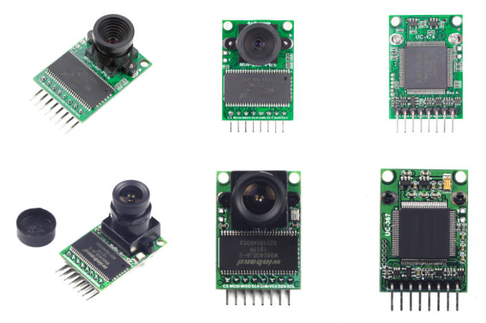
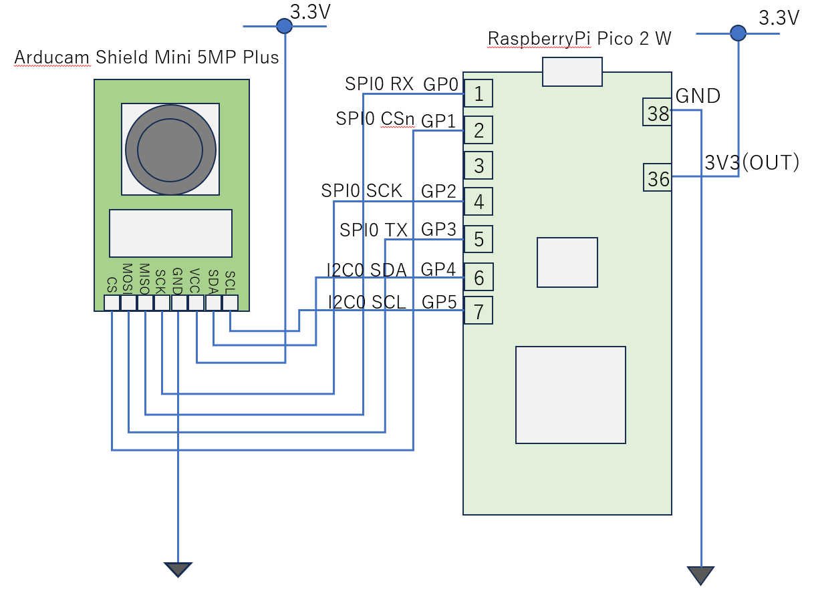
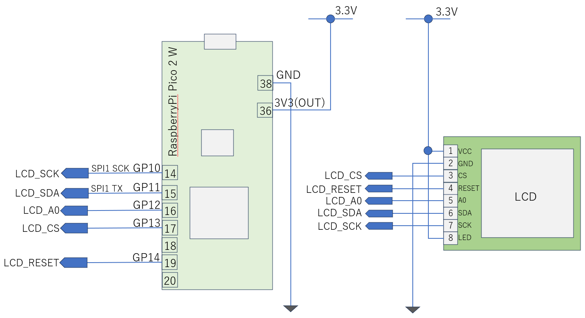

# Using CMOS Cameras

By connecting a CMOS camera to a microcontroller, you can handle images. Cameras that can be connected to microcontrollers include several popular models.

One of the challenges in handling cameras with microcontrollers is how to capture image data from the camera. Common connection interfaces with cameras are typically USB or parallel connections.

The characteristics of Arducam are as follows:
- Built-in image frame buffer
  - Captured images are temporarily stored in the frame buffer. The microcontroller reads data from the frame buffer.
- High-speed image capture via SPI connection
  - SPI connection enables high-speed reading of the frame buffer.
- Support for both RAW mode and JPEG mode
  - JPEG format is suitable when transferring images to the cloud, but uncompressed RAW mode is necessary when processing images on the microcontroller side. Both formats are supported.
- Support for low resolution
  - When processing images on a microcontroller, it is necessary to switch resolution according to processing time. Low resolution is often used for preprocessing such as target detection.

Arducam Shield Mini Appearance<br>
<br>
Image is quoted from Arducam Wiki (https://docs.arducam.com/Arduino-SPI-camera/Legacy-SPI-camera/Camera-Models/)<br>
Depending on camera performance, there are 2-megapixel (top) and 5-megapixel (bottom) versions. The 5-megapixel version uses the OV5642 image sensor.

### Camera Connection

The microcontroller and camera are connected using both SPI and I2C. Camera control, such as image resolution and format settings, is performed via I2C. Captured image data is initially stored in the frame buffer.



### Arducam (OV5642 5MPixel) Control

Arducam consists of a sensor part using OV5642 and a frame buffer section. The OV5642 is controlled via I2C, and frame buffer control is performed via SPI. Image quality and image size settings are configured through I2C control. Image data is not obtained directly from the OV5642 but is first stored in the frame buffer. Thanks to the built-in frame buffer, capture speed and data acquisition speed are independent.

Arducam driver prototype has been created and published as follows:
- [OV5642 Driver](src/lib/ov5642.py)
- [OV5642 FIFO Control Program](src/lib/ov5642_FIFO.py) (called from the above OV5642 driver (ov5642.py))
- [OV5642 Initial Setup Parameters](src/lib/ov5642_setup.py) (called from the above OV5642 driver (ov5642.py))

The implementation is limited to the minimum necessary functions, resulting in a short program. The images that can be captured with the above driver have a size of 160 x 128 pixels and RGB565 format.

Installation method for OV5642 driver suite:
```
import mip
PATH = 'https://raw.githubusercontent.com/foobarbazfred/Pico-MicroPython-Workshop/refs/heads/main/3-Day1-Foundation/src/lib/'
for file in ('ov5642.py', 'ov5642_setup.py', 'ov5642_FIFO.py'):
    mip.install(PATH + file)
```

### Arducam (OV5642 5MPixel) Sample Code

Below is an example of image capture using Arducam:
```
from machine import Pin
from machine import I2C
from machine import SPI
from ov5642 import OV5642

ov5642i2c = I2C(scl=Pin(5), sda=Pin(4), freq=9600)

CAM_PIN_CS = 1
fifo_cs = Pin(CAM_PIN_CS, Pin.OUT)

SPI0_BAUDRATE=10_00_000
SPI0_MOSI = 3
SPI0_MISO = 0
SPI0_SCK = 2
fifo_spi = SPI(0,SPI0_BAUDRATE,sck=Pin(SPI0_SCK), mosi=Pin(SPI0_MOSI), miso=Pin(SPI0_MISO))
ardu = OV5642(ov5642i2c, fifo_spi, fifo_cs)

SCREEN_WIDTH=160
SCREEN_HEIGHT=128
BYTEPERPIX=2  # RGB565

import gc
gc.collect()
buf = bytearray(SCREEN_WIDTH * SCREEN_HEIGHT * BYTEPERPIX)

ardu.fifo.clear_done_flag()       
ardu.fifo.start_capture_and_wait()
ardu.read_pixels(buf)
```

With the above operations, a 160x128 pixel image in RGB565 format is captured into buf. Currently, the driver implementation is incomplete, so high-pixel JPEG images cannot be captured. However, by developing the driver further (by understanding the sample code and determining which registers need to be configured), it becomes possible. Since the image is uncompressed, it can be used in MicroPython for edge detection and binarization conversion.

### Displaying Arducam (OV5642 5MPixel) Captured Images on LCD

The code to display captured images on a graphic display is as follows (graphics display initialization is omitted since the source code is long):

Demo source code including graphic display is located here:<br>
[ov5642_lcd_demo.py](test/ov5642_lcd_demo.py)

```
from machine import Pin
from machine import I2C
from machine import SPI
from ov5642 import OV5642

ov5642i2c = I2C(scl=Pin(5), sda=Pin(4), freq=9600)
CAM_PIN_CS = 1
fifo_cs = Pin(CAM_PIN_CS, Pin.OUT)

SPI0_BAUDRATE=10_00_000
SPI0_MOSI = 3
SPI0_MISO = 0
SPI0_SCK = 2
fifo_spi = SPI(0,SPI0_BAUDRATE,sck=Pin(SPI0_SCK), mosi=Pin(SPI0_MOSI), miso=Pin(SPI0_MISO))

ardu = OV5642(ov5642i2c, fifo_spi, fifo_cs)

SCREEN_WIDTH=160
SCREEN_HEIGHT=128
BYTEPERPIX=2  # RGB565

tft.rotate(1)   # rotate screen 90 degrees

import gc
gc.collect()
buf = bytearray(SCREEN_WIDTH * SCREEN_HEIGHT * BYTEPERPIX)
def show_image():
    global buf
    ardu.read_pixels(buf)
    tft._set_window(0, 0, SCREEN_WIDTH - 1, SCREEN_WIDTH - 1)
    tft.data(buf)

while True:
   ardu.fifo.clear_done_flag()       
   ardu.fifo.start_capture_and_wait()
   show_image()
```

In an RP2350 (150MHz) environment, the capture-to-display process takes 900ms. The capture performance is approximately 1 fps.

For the RP2350 and graphic display connection, please refer to the following schematic:



### Documentation

- https://docs.arducam.com/Arduino-SPI-camera/Legacy-SPI-camera/Camera-Models/
- Arducam-Shield-Mini-5MP-Plus
  - https://docs.arducam.com/Arduino-SPI-camera/Legacy-SPI-camera/Hardware/Arducam-Shield-Mini-5MP-Plus/
  - Sample code: https://github.com/ArduCAM/Arduino/blob/master/ArduCAM/ArduCAM.cpp

To further improve image quality, fine parameter adjustments are required. To fine-tune camera image quality and other settings, refer to the specification sheet of the image sensor (OV5642) and adjust the register settings accordingly.

5MP image sensor OV5642<br>
The specification sheet is not publicly available; only confidential specification sheets for developers who have signed NDA contracts appear to exist. Searching online, you can find specification sheets. Search for:
`OmniVision product specification datasheet OV5642`<br>

A complete set of sample code for Arduino is publicly available on GitHub. By reading through the source code, you should be able to understand how to configure registers for the OV5642.
