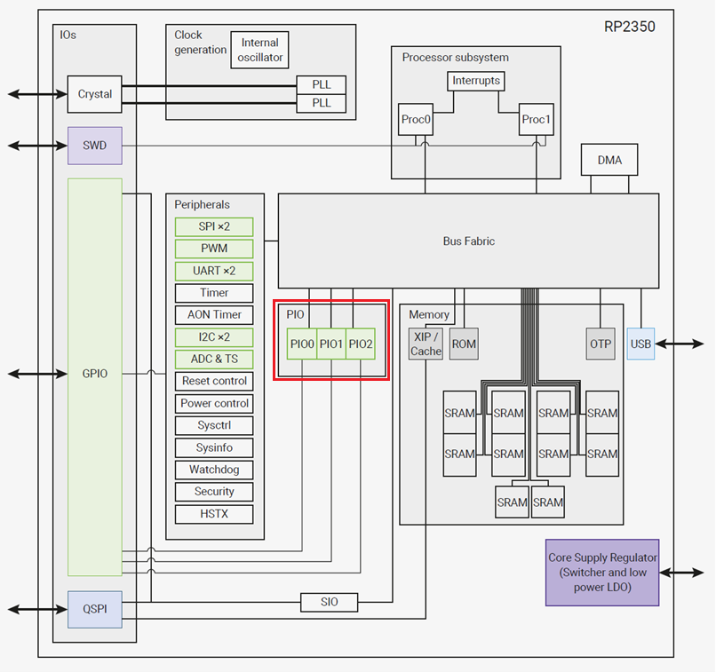
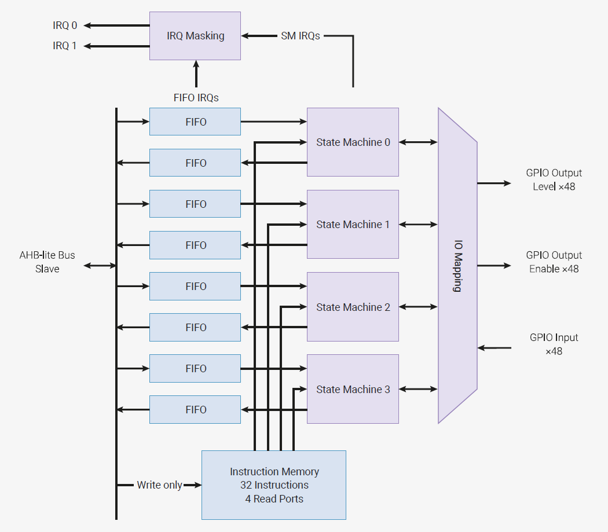
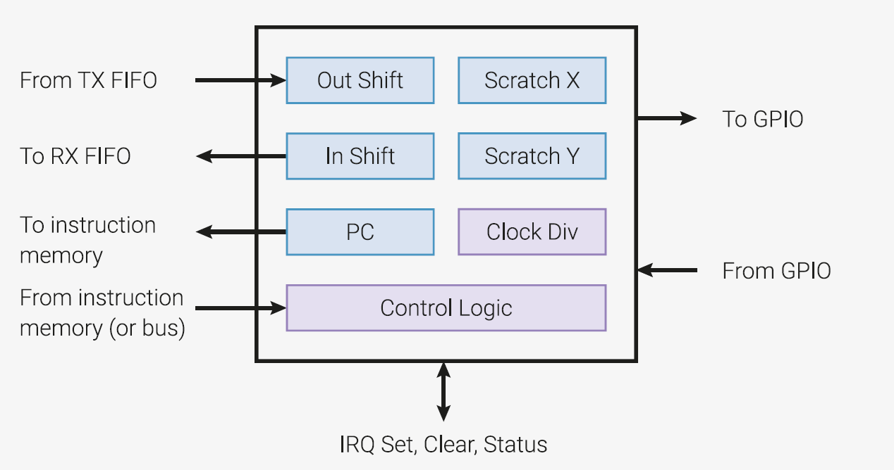
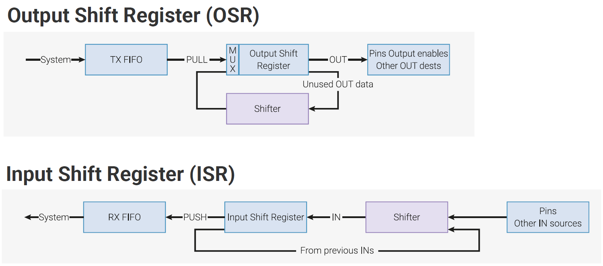

# PIO プログラミング解説
2021/5/17版

### PIOプログラミングを行う上で必要となる知識
PIOプログラミングを行う上で、StateMachine コンストラクタ、PIO クラス、asm_pio の仕様理解が必要です。

2021/5/16 時点で MicroPython ドキュメントに公開されている関連仕様は以下です。

StateMachine コンストラクタ
https://micropython-docs-ja.readthedocs.io/ja/latest/library/rp2.StateMachine.html#class-statemachine-access-to-the-rp2040-s-programmable-i-o-interface

PIO クラス
https://micropython-docs-ja.readthedocs.io/ja/latest/library/rp2.PIO.html

PIO アセンブラ (asm_pio)
https://micropython-docs-ja.readthedocs.io/ja/latest/library/rp2.html?highlight=pio_asm#pio-related-functions

PIO アセンブリ言語命令
https://micropython-docs-ja.readthedocs.io/ja/latest/library/rp2.html#pio-assembly-language-instructions

PIO サンプルコード(公式)
https://github.com/raspberrypi/pico-micropython-examples/tree/master/pio

RP2350 仕様概要
https://www.raspberrypi.com/documentation/microcontrollers/microcontroller-chips.html#rp2350

RP2350 Data Sheet
https://pip.raspberrypi.com/documents/RP-008373-DS

asm_pio のソースコードや関連資料をもとに仕様を整理したものです。

### PIO概説
RP2350のシステム図を以下に示します。他の周辺IOと同様にPIOはGPIOとマイクロコントローラの間に置かれており、外部のセンサや各種デバイスとの通信に使われることが分かります。 

PIOのダイアグラムを以下に示します。ステートマシンを中心に、命令語記憶部(Instruction Memory)、FIFOで構成されます。外部との入出力のためGPIOと接続されています。 

StateMachineを構成する機能ブロック 

PIOプログラミングを行う上で、上記機能ブロックに対して操作します。

Pinへのデータ出力、Pinからのデータ入力の観点でデータフローを整理 

### クロック等の制限(上限値、下限値)
- PIOの最高クロックはRP2350のシステムクロックと同一クロック(1分周、150MHz)動作可能
- PIOの最低クロックは、システムクロックに対して分周最大が65536のため、150MHz ÷ 65536 ≈ 約2.3kHzが設定可能な最低クロック
- RP2350のStateMachineを例にとると、最高クロックは150MHz、siteset、out命令、set命令でL/H変化する波形を生成する場合、最低2が命令必要。よって、PIOで生成できるクロックの周波数は最大75MHz
- PIOのInstruction Memoryは保持できる語数が32語 (RP2350)
- FIFOバッファは入力用と出力用に分かれている。32bit幅、4段 (RX-FIFO(4), TX-FIFO(4))
